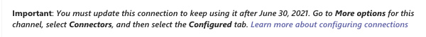
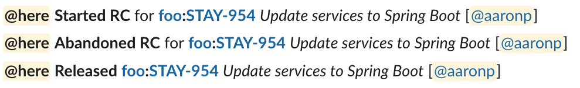
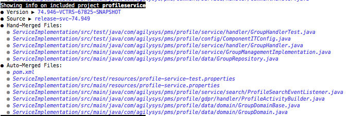
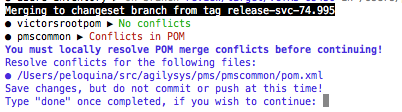
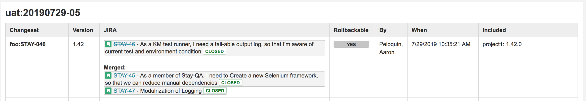
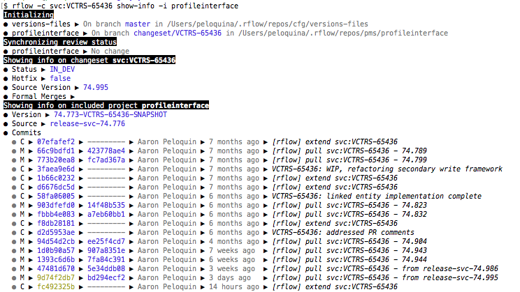

# Release Notes 

**Latest version:** [@agilysys-stay/stay-rbuild](https://dev.azure.com/agilysys/Stay/_packaging?_a=package&feed=PMS&package=%40agilysys-stay%2Fstay-rbuild&protocolType=Npm)

```
npm r -g @agilysys-stay/stay-rbuild && npm i -g @agilysys-stay/stay-rbuild
```

---
## NEXT

## 0.2.115
**Improvement** Enabled option -p or --perf-impr for goals "extend", "patch-rc", "push", "refresh-pr", "resume-rc", "start-rc", "start", and "submit-pr". With this changes, new pipeline jobs can be triggered through these goals.

## 0.2.114

## 0.2.113

## 0.2.112
Added mirror for jfrog in settings.xml- this is the temp fix for maven reaching artifactory

## 0.2.111
  **fix** Fix for bundle config.json overwritten on option -p. With this fix, option -p will work on build command only.

## 0.2.110

**New** Removed Jfrog configs - Jfrog Decommison

## 0.2.109
**New** A new feature has been added to rflow. With this feature, the new pipeline jobs will be triggered (STAY_orchestrated_build_perfImpr). This feature can be utilized by adding option -p or --perf-impr in the commands.

## 0.2.108
** Bufix - url not defined issue**

## 0.2.107

## 0.2.106

## 0.2.105
  **New** Added mi-prod-01-eastus environment for saving promote registry index

## 0.2.104
  **New** Added mi-prod-01-eastus environment for promoting images to agysacrprod registry.

## 0.2.103
  **fix** Fixed GitHub Packages API pagination issue where only the first 30 versions (page 1) were being checked

## 0.2.102
  **from Github Migration** Support Artifact Lookup in Both GitHub Packages and Artifactory - Added error loggings

## 0.2.101

  **Migration** Support Artifact Lookup in Both GitHub Packages and Artifactory

## 0.2.100
  **Improvement** Development team has been pulling code from one trunk to another trunk for testing, due to this number of work items associated with each trunk has been increasing (200+), however the system imposes a limit of 200 work items per API request. This resulted in errors in identifying changesets that are not in production stage in trunk shipments. 
  
  To address this, modifications were made to skip identifying changesets that are not in production stage for trunk shipments by default. If anyone wants to use this, they can pass the newly introduced optional argument "shipment-changeset" to prepare shipment command.
  
  For example: **rflow -s uat:20241231a prepare-shipment -i ui:release24_7 svc:release24_7 naag:release24_7 --shipment-changeset**


## 0.2.99
  **fix** Fix for aggregator version issue in prod: aggregator image pipeline was not triggered as no version change detected in Scala aggregator in environment versions. The version check logic has been removed now, as thorough image existence checks are still performed in both dev and prod registries. This ensures there are no deployment delays, as existing validation process ensures that images for unchanged versions are already available in the registries.
## 0.2.98
* **New** A new repository "Foundations" has been added to settings.xml by Performance Dev team.  

## 0.2.97
  **fix** Bug fix - Git latest upgrade - 2.47 fails to check file modes with summary and exit-code. Added name-only to resolve the issue

## 0.2.96
* **New** A new feature has been added to rdeploy. With this feature, production images will be promoted to prod registry from dev registry.

## 0.2.95

## 0.2.94
  **fix** Bug fix - Approval notifications not displaying in teams mobile app

## 0.2.93
  **New** Migrated Teams webhook connector to teams workflow as the current connector is going to be deprecated by Microsoft.
## 0.2.92
* **fix** Reverted rsync changes to fix startsWith error.


## 0.2.91
* **New** A new enhancement has been made to shipments. With this newly added feature, shipments can be created from trunks.


    Example command: rflow -s uat:20240630j prepare-shipment -i ui:release12_10 svc:release12_10 naag:release12_10
  
  **Note:** Shipments created from trunks cannot be approved. To deploy trunk shipments in an environment, please use the shipment id. Refer to the following command for example:
   
    rdeploy -e aks:stay-aks-dev uat:20240630j
  
  

## 0.2.90

## 0.2.88
* **New** A new feature "run-image-pipelines" has been added to rdeploy. 
With this argument, we can trigger image pipelines.

    Example command: rdeploy -e aks:stay-aks-dev ui:RGSTAY-317848c --run-image-pipelines
  
  **Note:** If the version is already deployed in an environment, it will indicate that no changes were detected. To redeploy an existing version, please use the "--force" command. 
    
    Example command: rdeploy -e aks:stay-aks-dev ui:RGSTAY-317848c --run-image-pipelines --force


## 0.2.87

* **New** "Run Jacoco" feature has been added to rflow for the goals that have the build option. 
With this argument, code coverage report can be generated in Jenkins builds.

    Example rflow command: rflow -c ui:RGSTAY-317848c build --jacoco

## 0.2.86


## 0.2.83

* **New** feature to notify trunk marker updates to release managers on start-rc approval.

## 0.2.82

## 0.2.81

## 0.2.80

## 0.2.79

## 0.2.78

## 0.2.77

* **New** Added --skip-test argument for the following changeset build goals (Start, Build, Extend, Push, Refresh PR, Submit PR).
* **Improvement** skip's the test on jenkins build to complete the build faster.

## 0.2.76

* **New** Skip build option is set as default for rflow goals "push", "submit-pr" and "refresh-pr", which means that Jenkins builds will be skipped by default. 
However, a build can be triggered by adding "--build" argument to rflow command (For example: rflow -c ui:RGSTAY-317848c push --build). 

## 0.2.75

## 0.2.74
* **New** JDK 17 default version change has been implemented.


## 0.2.73

* **New** Added support for Github.
* **Improvement** Use rsync instead of fscopy, to make repo copy faster.

## 0.2.72

* **Improvement** Added _config-repo-branch-image_ for switching config-repo branch while doing pipeline image build.

## 0.2.71

* **Fix** Errors during bundle checkout were not failing the command.

## 0.2.70

* Trunk special character fixes.

## 0.2.69

* **Improvement**  `Trunk` now supports special characters  `_,-,.` in trunk creation for future trunk releases.

## 0.2.68

* **Fix** Issues with `prepare-shipment` and `approve-shipment` introduced in _0.2.66_.

## 0.2.67

* **Improvement** Ability to limit the number of forked processes during concurrent operations.  This can be specified
  as locally in config by setting `maxForkCount` as a top-level attribute in _~/.rflow/config.json_, or on a per-command
  basis via the `--max-fork-count` or `-x` parameter (e.g. `--max-fork-count 10` to limit forking to 10 processes).

## 0.2.66

* **Improvement** Added support for multiple changesets to be associated with a single Azure DevOps ticket via a single
  lowercase letter postfix on the changeset ID.  For example: `svc:158104`, `svc:158104a`, and `svc:158104b` all
  reference the same `158104` ticket.  This can be useful when code needs to be relocated on another trunk or a new
  changeset ID is necessary to deal with artifact issues: there is no need to create a dummy ticket in Azure DevOps and
  you can avoid the confusion that results from the changeset and the original user/story bug having different IDs.
* **Maintenance** Removed JIRA support.
* **Maintenance** Removed JIRA ticket helper text for mongoops/postgresops and PR creation for support projects from
  `approve-shipment`.
* **Fix** `patch-rc` was incorrectly identifying version changes for _dependency_versioned_modules_ (e.g.
  _integration-root-pom_).
* **Fix** `patch-rc` was triggering builds of unmodified, already-built projects causing unreferenced release
  artifacts and incorrectly advanced versions on the release branches.

## 0.2.65

## 0.2.63

## 0.2.62

* **Fix** [rDeploy] artifact transfer - Throw an error when API calls to Artifactory or Azure Artifacts return unauthorized.
* **Fix** [rDeploy] artifact transfer - Show URL of missing Artifactory artifact when it doesn't exist

## 0.2.61

* **Fix** [rDeploy] artifact transfer - Purge the source (JFrog) artifact (not the `.webapp.` one)
* **New** [rDeploy] added `--docker-tag-suffix` to build alternate images of the same artifact build
* **New** [rDeploy] added `--devops-pipelines-branch` to use an alternate branch (this repo contains the docker layouts)
* **Fix** [rDeploy] snapshot images will not be rebuilt when `--skip-snapshot-transfer` is supplied.

## 0.2.60

## 0.2.59

## 0.2.58

* **Fix** Resolved issue with shipment auditing when Azure DevOps ticket has been deleted since the changeset was 
  created.

## 0.2.57

* **New** [rDeploy] added `--args` option for passing arbitrary arguments
* **Fix** [rDeploy] run-db-script - acquire approvals when needed

## 0.2.56

* **New** [rDeploy] support for `lab` environment types (an alias for aks)
* **New** [rDeploy] support for testpool workflows
* **Fix** [rDeploy] added commit message for roll-out requests

## 0.2.55

* **Fix** [rDeploy] save roll-out request even when skipping the deployment pipeline (so one can run `kappctl` manually)

## 0.2.54

* **Fix** [rDeploy] add await to checkout so properly report capture exceptions

## 0.2.53

* **Fix** [rDeploy] correct roll-out data path for config source

## 0.2.52

* **Improvement** [rDeploy] will recognize the environment override of config-repo source branch
* **Dev** Added azure-pipelines.yml for automated builds

## 0.2.51

* **Fix** [rDeploy] Address deadlock issue (avoid deasync during pipeline wait loop)

## 0.2.50

* **Improvement** [rDeploy] AKS deployment versions are no longer stored in config-repo.

## 0.2.49

* **Fix** Missing PR links in `approves-shipment` output.
* **Fix** Incorrect path for _azure-inventory_ in JIRA ticket templates for `approve-shipment`

## 0.2.48

* **Fix** `prepare-shipment` unable to locate _hotfix_ branches for support projects.

## 0.2.47

* **Fix** `promote-rc` failed to checkout excluded files during for hotfix changeset.

## 0.2.46

* **Fix** [rDeploy] _ConfigError: Unable to add user with adUsername_.

## 0.2.45

* **Fix** `pull --production` was filtering out excluded projects based on uninitialized field.
* **Fix** `pull --production` was updating trunk marker when release version had not advanced.

## 0.2.44

* **Fix** [rdeploy] Overwrites user file in _versions-repo_ with empty data.

## 0.2.43

* **Improvement** Branch names for new changesets and RC's now include bundle name to avoid branch collision for support
  projects when the tracking number is shared between multiple changesets, e.g _svc:001_ and _ui:001_.

## 0.2.42

* **Fix** _TypeError: Cannot read property 'plain' of undefined_ during `rdeploy`. (same issues as in 0.2.41, but 
  different location)
* **Fix** During `pull`, `merge`, `start-rc`, and `promote-rc` operations involving hotfixes, excluded projects included
  projects that were released but not yet in production.
* **Fix** When `pull --production` on a hotfix, HF versions were getting pulled in instead of adding the project to the
  changeset.

## 0.2.41

* **Fix** `approve-shipment` generates _undefined.yml_ instead of _approved.yml_.
* **Fix** _TypeError: Cannot read property 'plain' of undefined_ during `rdeploy`.

## 0.2.40

* **Fix** Unable to `start-rc` on hotfix while there is a project that has been released but is not in production.
* **Fix** Prevent persistence of _undefined.yml_ in _user_ directory of _versions-repo_.

## 0.2.39

* **Improvement** Themes now include the ability to customize the bullet and arrow characters as well as the spinner. 
  This may come in handy if your console is unable to display the default characters.
  * _bulletChar_ and _arrowChar_ are single character values
  * _spinner_ is an array of 1 to 14 single character values that will be cycled through every second
  * Unicode escape sequences are accepted, e.g. `"\u25B8"`.
  
  Examples:
    * Simple ASCII
      ~~~
      "themeOverrides": {
        "bulletChar": "*",
        "arrowChar": ">",
        "spinner": ["<", "^", ">", "v"]
      }
      ~~~
    * Fun with spinners
      ~~~
      "themeOverrides": {
        "spinner": ["▉","▊","▋","▌","▍","▎","▏","▎","▍","▌","▋","▊","▉"]
      }
      ~~~
* **Fix** _TypeError: Cannot read property 'substring' of undefined_ in _Determining action for excluded projects_
  during a `merge` when there is a recently added project (such as _config-repo_).
* **Fix** Another variation of _BuildError: Release tag release-xxx is missing for yyy_ during `pull` or `merge` where
  _yyy_ is a recently added project (such as _config-repo_).
* **Fix** _integration-root-pom_ versions were not getting updated to match the changeset version.
* **Fix** Prompts not displaying when theme is `[]`.
* **Fix** Reviewers not getting added to pull requests.

## 0.2.38

* **Fix** _BuildError: Release tag release-xxx is missing for yyy_ during `pull` or `merge` where _yyy_ is a recently
  added project (such as _config-repo_).
* **Fix** _TypeError: Cannot read property 'name' of undefined_ when triggering builds.
* **Fix** _TypeError: Cannot read property 'getAbsolutePath' of undefined_ when running `rdeploy` with
  _personal_settings_ not seeded.
* **Fix** Error when support project is added during `pull` or `merge` that already has a branch from a changeset with 
  the same ID on a different bundle.

## 0.2.37

* **Fix** _Jenkins: Error: no auth mechanism defined_ when triggering builds.

## 0.2.36

* **Improvement** Color themes have been added. There is a _light_ (default) theme and a _dark_ theme, as well as
  the ability to customize.
  * To explicitly select a theme, add `"theme": "dark"` as a **top-level** field (not under _personal_settings_) to your
    local _config.json_ under either_~/.rflow_ or _~/.rdeploy_.
  * To override specific values, add `themeOverrides` as a **top-level** field (not under _personal_settings_) to your
    local _config.json_ and provide key/value pairs to override one or more of the following:
    ```
    "themeOverrides": {
      plain: [],
      useful: 'blue',
      trivial: 'gray',
      good: 'green',
      warn: 'yellow',
      bad: 'red',
    }
    ```
    You don't need the full set, just what is being overridden.  The list of acceptable values can be found
    [here](https://www.npmjs.com/package/colors).  Note that a value of `[]` applies no color and results in the default
    console color.
* **Improvement** Minor refactor of _personal_settings_ seeding. Distinction added between AD and Stash usernames as
  the latter are case-sensitive and the former are not.  _stash_username_ is looked up via API (as is
  _azure_identity_id_).
* **Fix** _The authenticity of host 'xxx' can' be established_ when connecting to new servers for the first time.
* **Fix** Merges to review branches as part of `pull` or `merge` could occur in the wrong working directory.

## 0.2.35

* **Fix** _Error: TF400813: The user '' is not authorized to access this resource._ while trying to lookup Azure 
  identity when Azure access token didn't already exist in local config.
* **Fix** Failure during _Ensuring projects have latest commits_ section of `start-rc` for _PENDING_ support projects.
* **Fix** Failure during _Ensuring projects have latest commits_ section of `promote-rc` for changesets that only have
  support projects.

## 0.2.34 

* **Fix** _TypeError: Cannot read property 'blue' of undefined_ error during `-shipment` operations.
* **Improvement** Added capability to support projects from Azure repos including pull request generation. This 
  introduces two new requirements for running `rFlow`:
  * `user.email` in your global git configuration must be set to your Agilysys email address; if you don't have it, you 
    can set via `git config --global user.email {your-address-here}@agilysys.com`
  * The Azure personal access token in your _~/.rflow/config.json_ file must have 'Full access' scope (assigned 
    [here](https://dev.azure.com/agilysys/_usersSettings/tokens)).

## 0.2.33

* **Fix** Projects with existing review branches could end up with conflicts committed and yet not identified in output
  during `pull` or `merge` operations.
* **Improvement** Added forked processing for _Determining actions for included projects_ and _Checkout other projects
  if relevant_ sections of `pull` or `merge` operations.

## 0.2.32

* **Fix** _TypeError: Cannot read property 'trunkFile' of undefined_ during `pull`.
* **Fix** _NewError [ForkedOutputError]: Position not found for XXXX_ when messages are delayed due to network latency.

## 0.2.31

* **Improvement** Replaced delayed start indication text for forked processing with spinner.
* **Fix** Forked processing project list longer than # of terminal rows skews output.

## 0.2.30

* **Improvement** Added start indication text for forked processing.
* **Fix** _Cannot read property 'PULL_REQUEST' of undefined_ during `submit-pr`.
* **Fix** _BuildError: Branch is not being tracked: changeset/RGSTAY-xxxxx_ on excluded support projects during 
  `start-rc`. 
* **Fix** `pull` failed to include excluded support projects whose mainlines had been externally updated.
* **Fix** Use of _Object.keys_ instead of _Object.values_ when matching values against _static_ constants maps.
* **Fix** Error in artifact and docker image validation for `promote-rc`.

## 0.2.29

* **Improvement** Support added for forked processing and output for most operations that iterate over projects.

## 0.2.28

* **Fix** [rdeploy/aks] Update Azure Container Registry history after image build

* Abandon custom bootstrapped NODE_PATH
  * Makes it easier for other tools (IntelliJ) to assist
  * Less magical for the uninitiated
  * Bootstrapping (rbuild-node-env.js) is still in place as it provides NODE_BASE_DIRECTORY

## 0.2.27

* **Fix** [rdeploy/aks] Handle exceptions when comparing versions of different trunks

## 0.2.26

* **Improvement** `submit-pr` will now send notifications to [#Pull-requests](https://teams.microsoft.com/l/channel/19%3aeb3c7463b85f46b88e35b4594e4da95a%40thread.skype/Pull-requests?groupId=3e85caa3-6780-41b6-8c87-bfb93d297305&tenantId=9750a820-9364-4bc3-9990-123c1645274b).
* **Fix** Adding catch block for handling azure-devops permissions.


## 0.2.25

* **Fix** `pull` on trunk changeset with source bundle version on _master_ (i.e. created before first changeset released
  to the trunk) was not advancing the source bundle version.
* **Improvement** Teams connector updates to remove this footer from generated messages.
  

## 0.2.24

* **Fix** _fatal: ambiguous argument 'origin/changeset/RGSTAY-xxxxx': unknown revision or path not in the working tree_
  error on `pull` where legacy inclusion keys exist in the trunk yaml.
* **Fix** _TypeError: Cannot read property 'toString' of undefined_ on `pull` where legacy trunk update value for
  current trunk exists in changeset yaml.
* **Fix** _com.agilysys.waper_ whitelisted so _waper_ dependency updates won't show up in all PRs.
* **Fix** POM merge driver was not correctly handling version comparisons for excluded artifacts on the same trunk.

## 0.2.23

* **Feature** [rflow] Adding PR links to azure devops in `submit-pr`

## 0.2.22

* **Fix** `start-rc` was checking _master_ instead of the release tag when validating production commits for support
  projects.

## 0.2.21

* **Improvement** `merge` and `pull` have been refactored to use simpler, shared logic for targeting actions.  The
  resulting code is easier to maintain and addresses numerous edge cases not handled by the prior implementation. 

## 0.2.20

* **Fix** First trunk candidate based off of _released_ instead of when the changeset was started. This can lead to 
  project version higher than bundle versions.
* **Fix** Several merge issues across trunks or within a trunk including changesets started before the trunk yml
  exists (created on first release to trunk).
* **Improvement** Trunk marker updates are identified and must be acknowledged as part of `merge`, `pull`, and
  `start-rc` operations.
* **Improvement** `start` no longer requires the `--include` option; this is useful when starting a changeset intended
  only for a `merge` or `pull`.

## 0.2.19

* **Fix** _TypeError: Cannot read property 'all' of undefined_ during `start-rc`

## 0.2.18

* **Fix** _TypeError: project.getStatus is not a function_ during`confirm-shipment` 

## 0.2.17

* **Feature** [rdeploy/aks] Request/approve deployments to moderated environments (`feature/moderated-deployments`)
* **Gift** Approval code entry gives you 3 attempts before bailing

## 0.2.16
* **Fix** `start-rc` on a trunk without any releases was comparing versions to _released_ causing invalid version
  requirements.
* **Fix** Inclusion fields are only needed on hotfix releases.
* **Dev** Initial implementation of trunk-compatible support for `RETIRED` projects 

## 0.2.15
* **Fix** [rdeploy] will now find `/etc/rdeploy/config.json`

## 0.2.14
* **Fix** master trunk marker was not set when creating the first changeset on a new trunk.
* **Improvement** Release pipe notifications for trunk changesets are directed to a new channel _Release Pipe (Trunks)_.

## 0.2.13
* **Fix** Unable to deploy reason Support projects issue.

## 0.2.12

* **Improvement** Multiple fixes to implementation of _PENDING_ project status, including assimilation into trunk 
  workflow.
* **Fix** Unable to pull on first trunk changeset when support project branches have been externally updated.

## 0.2.11

* **Fix** [rdeploy] Wrong branches of support projects checked out during non-AKS deployments.
* **Fix** _TypeError: Cannot read property 'inclusion_key' of undefined_ during `confirm-shipment`.
* **Fix** Support projects that had been in the most recently released changeset were getting auto-included in new
  changesets.

## 0.2.10

* **Fix** When reusing a released changeset, commits were getting auto-approved resulting in unintentional bypassing of
  the PR requirement for updates.  Fix includes some improvements to commit graph traversal.

## 0.2.9

* **Feature** New `compare` goal allows changeset diffs between alias IDs, e.g. `compare -a svc:gamma -b svc:released`.
  * `--simple` option provides an output option with less details
  * `--document` option generates Confluence HTML output format (same as for _shipment_ documentation)
* **Feature** Changesets may now be released more than once, allowing incremental development without changeset 
  proliferation.  
* **Improvement** _Rollbackable_ functionality has been removed due to irrelevance.

## 0.2.8

* **Improvement** [rdeploy] will read configuration from `/etc/rdeploy/config.json` if present. This
  allows us to put the alternate `artifactoryBaseUrl` in one place for lab-stay-general-purpose
  users.

* **Fix** [rdeploy] added Azure Artifact Feeds for Platform and Core to ad-hoc setting.xml used when
  transferring Maven artifacts to Azure.

* **Dev** upgraded ESLint
* **Dev** added `bulletRow` for your one-liner
* **Dev** refactored AKS into its own Bundle class
* **Dev** sleeping AKS roll-out code exists

## 0.2.7

* **Fix** _fatal: Needed a single revision_ on support projects when doing a pull. Repo was being used without
initialization.

## 0.2.6

* **Fix** Snapshot builds will be updated in AKS. (`isSnapshot()` was updated to be case-insensitive.)

## 0.2.5

* **Fix** _Initializing secondary_ fails when local config doesn't have `personal_settings.rflow_workdir`.
* **Fix** `create --trunk` operations fail when local `~/.rflow/repos` for support projects have not been seeded by a 
         previous operation. 

## 0.2.4

* **Fix** Added trunk details (where available) to Teams notifications.
* **Fix** Issue with setting _next_version_ field for trunks.

## 0.2.3

* **Fix** Moved trunk qualifier version delimiter from `#` to `.` for docker tag compatibility.

## 0.2.2

**Fix** Skip loading docker-registry-index for non-AKS environments

## 0.2.1

Version fumble (does not exist)

## 0.2.0

**Please follow the setup instructions to connect to the new Azure DevOps NPM registry where this
package is now being maintained:**

[@agilysys-stay/stay-rbuild version](https://dev.azure.com/agilysys/Stay/_packaging?_a=package&feed=PMS&package=%40agilysys-stay%2Fstay-rbuild&protocolType=Npm)

**rflow**

* **Fix** _project.getVersionsKey is not a function_ error during `confirm-shipment` 

**rdeploy**

* **Fix** Avoid redundant docker-image builds (by tracking what pipelines have pushed to the ACR)

---

## 0.1.153

* **Feature** Multiple concurrent development **trunks** are now supported.
  * _Start a trunk:_ Manually add to bundle _config.json_ (for now).  Please do only with approval.<br/>
    ```
      "trunks": [
        {
          "name": "sometrunk"
        },
        {
          "name": "othertrunk"
        }
      ]
    ```
  * _Start a trunk changeset:_ `start --trunk sometrunk`
  * _Pull latest..._
    * _from trunk_: `pull`
    * _from another trunk_: `pull --trunk othertrunk`
    * _from released (master)_: `pull --released`
    * _from production_: `pull --production`
    * _from production hotfix_: `pull --hotfix`
  * _Release a trunk changeset to the trunk:_ 
    * `start-rc` and `promote-rc` (as well as `resume-rc` and `patch-rc`)
    * Only one changeset can be in RC for a trunk at any given time; an RC candidate is created for the trunk.
    * The release pipe moderation does not apply to trunks. 
    * A changeset can only be released to the trunk it was created from (for now).
  * _Deployment:_ 
    * `rdeploy` allows you to identify a trunk or even a trunk candidate via alias, e.g. `svc:sometrunk` or 
      `svc:sometrunk-candidate`
    * Shipments can **not** be created from trunks. Shipments are for deployment to production, and trunks must be 
      merged back into the mainline before they can be part of a production deployment.
  * _Merge a trunk back into the mainline (released):_ Create a standard, non-trunk changeset, `pull --trunk sometrunk`,
    and then release the changeset.
  * _End a trunk_: Not yet supported, lifecycle management will be determined pending review of trunk usage by the team.
  * _Important to note:_
    * While trunks facilitate parallel deployment, they do not reduce the merge workload required to keep things in 
      sync.
    * There are a few key improvements this workflow offers over the 'bundle' changeset approach that has been in use:
      * Changesets must be PR'd and pass release builds before they officially become part of the trunk.
      * New changesets are created from the current released state of the trunk, making it significantly easier to make 
        bugfixes or incremental changes.
      * All changesets released (to a trunk or the mainline) are documented in shipments.
    * Like hotfix reconciliation, pulling from another line or trunk will potentially add projects to your changeset to 
      facilitate the transfer of changes.
    
* **Feature** `checkout` now supports aliases via the `-a` or `--alias-id` parameter.  This allows you to checkout:
  * Production code, e.g. `-a svc:production`
  * Released code, e.g. `-a svc:released`
  * Hotfix code, e.g. `-a svc:hotfix`
  * Trunk code, e.g. `-a svc:sometrunk`

* **Improvement** Pulls for regular changesets now have options for `--production` (replaces `--from-prod`) and 
  `--hotfix`; the latter allows you to pull from released, but not yet deployed, hotfix changes.  
* **Improvement** Shorthand introduced for Azure DevOps changesets.  The `RGSTAY-` prefix can now be omitted, e.g.
  `svc:20191` is equivalent to `svc:RGSTAY-20191`

* **Fix** `patch-rc` now correctly handles scenarios with incomplete or failed builds.
* **Fix** PRs for _integration-core_ no longer present _root-pom_ version changes.
* **Fix** `checkout-all` now includes support projects.
* **Fix** Excluded projects now correctly update during `pull` or `merge` if `checkout-all` was previously used.
* **Fix** Conflicted file in support projects during `pull` or `merge` are now shown in the console.
* **Fix** Conflicted files during `pull` or `merge` are now listed in the same order as `git status`.
* **Fix** PRs for support projects or hotfix reconciliation now only show non-inherited changes (same as other PRs).

## 0.1.152

* **Feature** Support for AKS deployments (`-e aks:stay-dev` for example)
* **Internal** Added `---` document header to YAML output so to eliminate unnecessary differences with YAML written by Python (Ansible).
* **Internal** Updated (audit fix) dependencies

## 0.1.151

* **Improvement** Allow the configuration type to be part of the environment parameter. For example:
  ```
  rdeploy --devtest -e my-vagrant     # OLD (still works)
  rdeploy -e devtest:my-vagrant       # NEW
  ```
* **Chore** Started to convert the Web Apps logic to AKS (`-e aks:aks-stay-dev`)

## 0.1.150

## 0.1.149

* **Fix** Undid misguided fix from 0.1.148.
* **Fix** Now tags excluded support projects correctly during hotfixes.

## 0.1.148

* **Fix** Removed 'master' commit check for support projects when RC'ing a hotfix.

## 0.1.147

* **Fix** Removed hack from 0.1.146 and instead added support for `dependency_versioned_modules` in project 
  configuration to allow rFlow to manage dependency versions inside modules.  This should only be used for special 
  circumstances (such as _integration-root-pom_ inside of _integration-core_).

## 0.1.146 

* **Hack** merge-pom - Temporary workaround to allow integration projects to move away from using ${project.version}

## 0.1.145

* **Fix** rbuild - Upload to azure will retry after receiving 503 errors.

* **Dev** rbuild - Added `debug.keep_temp` flag to inspect temporary files that would normall be removed when the process exits.

## 0.1.144

* **Internal** rbuild - Updated web app pipeline triggers and added redeploy action

## 0.1.143

* **Internal** Made the devops-pipelines repository configurable and switched over to master.

## 0.1.142

* **Improvement** Consolidated Azure DevOps tokens into one - `azure_devops_token` (which is what is
used by rflow. This does however mean the token provided should have all permissions.

* **Improvement** Web App deployments - service versions are now maintained in config-repo and
  deployments are triggered through the API with parameters.

* **Improvement** Git version >= 2.10.0 is required to ensure line-ending enforcement is handled
  correctly and master is not tainted.

* **Improvement** Added `--no-build` option for `push` and `submit-pr` goals for when you want to micromanage builds.

## 0.1.141

* **Fix** Web app deployment repositories no longer auto-merge from master

## 0.1.140

* **Fix** Artifactory -> Azure Artifacts
    * Force a check for updated snapshots on remote repositories

## 0.1.139

* **Improvement** Support added for Azure DevOps work items
    * _VCTRS_ and _STAY_ qualifiers for changeset IDs will continue to link to JIRA tickets
    * _RGSTAY_ qualifier for changeset IDs will link to Azure DevOps work items
    * For all new changesets, the tracking ID must refer to a valid item (in JIRA or Azure DevOps); existing changesets 
      are grandfathered in.

* **Fix** _NODE_TLS_REJECT_UNAUTHORIZED_ warning message has been suppressed in the console output.

## 0.1.138

* **Improvement** rDeploy - Web apps

    * Smoother confirmation flow
    * Accommodate NAAG snapshots which aren`t published by Jenkins
    * Accommodate legacy mavens

## 0.1.137

* **Improvement** rDeploy - Web apps - Will acquire Azure Git HTTPS credentials and manage git-credentials configuration

    * This works around the ssh connection limit imposed on AGYS corporate network outbound:
      https://dev.azure.com/agilysys/Stay/_workitems/edit/1004

* **Improvement** rDeploy - Web apps - Snapshot artifacts will always be transferred and deployed

    * However, setting `immutable_snapshots` for the deployment definition in `versions-files/rdeploy/config-webapp.json` will avoid this automatic behavior and treat snapshots like releases

* **Fix** rDeploy - Web apps - Always update the .trigger so --force and SNAPSHOT updates work as expected

* **Improvement** rDeploy - Web apps - Project initialization concurrency can be limited/batched

* **Improvement** rDeploy - Web apps - Download using Maven to improve integrity and troubleshoot mysterious binary truncations in Azure

* **Improvement** rDeploy - Mapped 'blue' to 'cyan' for better visibility on terminals with a dark background

## 0.1.136

* **Fix** rDeploy, `TypeError: Cannot read property 'requiredSettings' of undefined` (for real this
  time)

* **Improvement** Web app deployments: add --force to deploy even when versions are up to date

* **Improvement** Web app deployments: deployment repositories will automatically merge from master

## 0.1.135

* **Fix** rDeploy, `TypeError: Cannot read property 'requiredSettings' of undefined`

* **Fix** rFlow, `fatal: ambiguous argument '8.1134e+28': unknown revision or path not in the working tree.`

## 0.1.134 (Do not use, yaml serialization issue)

* **Fix** Updated `deasync` dependency for NodeJS > 12.9.x

## 0.1.133 (Do not use, deasync issue)

* **Improvement** Web App deployments: will gather required personal settings

* **Improvement** Web App deployments: will check for and upload artifacts

## 0.1.132 (Do not use, yaml serialization issue)

* **Fix** Start and abandon RC notifications will now be sent to the release pipe channel.

* **Feature** Web App deployments (for lower environments)
  * Invoked with `--webapp` flag
  * Environments (currently `dev` and `qa`) are defined in the bundle configuration
  * Use `--only` to deploy a single project
  * Version downgrades are shown in red
  * Will prompt to review versions and proceed
  * An environment's last-deployed versions are saved to `versions-files/stay/deploy/webapp-${env}.yml`
  * Deployment pipelines are triggered as a consequence of updating its repository. This will change
    on the next release (will be manually triggered here).

* **Dev** Configuration variable `gitBaseUrl` is now `gitBaseUrlSpec` and contains a `%s` for
  the repository name. (Bitbucket ends with `.git` where Azure does not.)

* **Dev** Added `debug.no_checkout_versions_repo` configuration so to iterate on the local copy

* **Dev** Added `util.generateScript` and supporting functions to compile a bash script on the fly

* **Dev** Added `init-repo.sh` template which is a stripped-down version of `checkout.sh` used for
  deployment projects. Worth mentioning because it's a pattern that will likely be taken forward.

* **Dev** Added `.npmrc` to clarify as we move into Azure

## 0.1.131

* **Fix**: Contain notification failures. This resolves the issue blocking deployments from
 _endpoint-bastion-01a_ (it appears such outbound traffic is firewalled).

## 0.1.130 (Do not use)

* *Do not use (remote change verification)*

## 0.1.129 (Do not use)

* *Do not use (remote change verification)*

## 0.1.128

### Improvements

* Added support for MS Teams notifications

* Redirected all notifications from Slack to Teams (rflow, rboss, rdeploy)

* Added NodeJS version to Help

### Developers

* New debug setting: `skip_jira_interaction` mocks these fake issue ids

* New debug setting: `notify_during_dry_run` enables teams notifications since we can't post to
  @username

* Additional tweaks explained in ISSUES.md

## 0.1.127

### Issues Fixed

* _Error: spawnSync git ENOBUFS;_ during `x-ray`; upped buffer size from 1M to 10M

## 0.1.126

### Issues Fixed

* _project.getPrimaryVersionsKey is not a function_ when doing a `pull --from-prod` with support projects

## 0.1.125

### Issues Fixed

* Initialization failures due to _would clobber existing tag_ errors.
* Cannot merge released hotfix changeset.

## 0.1.124 (Mandatory for shipments)

### Issues Fixed 

* _TypeError: changeset.getHotfixSupportBranch is not a function_ on `prepare-shipment` for hotfix

## 0.1.123

### Issues Fixed

* Support project commits orphaned on a stacked hotfix due to premature tagging
* `pull` on a hotfix doesn't bring in support projects that were part of a released hotfix
* `shrink` allows removal of a support project on a hotfix

## 0.1.122

### Issues Fixed

* `pull` for hotfix on _databasescripts_ did not pull _master_.
* _TypeError: project.getPrimaryVersionsKey is not a function_ on support project when RC'ing a stacked hotfix

## 0.1.121

### Improvements

* Moved release pipe management validation to after all other validations for `start-rc` and `promote-rc`.  Removed it 
entirely from `resume-rc`. 
* Release managers are notified when an approval code has been used.
* `merge` is now supported for hotfix changesets.  You can only merge in changesets that have a source bundle version 
that is not newer than production.

### Issues Fixed

* `checkout-all` of changeset that was started before a _PENDING_ project was released results in _cannot read property 
'toString' of undefined_
* _rsync_ error related to temp files during async checkout
* Support projects are now supported for hotfixes in shipments
* `merge` was pulling in excluded versions regardless of which changeset was newer 
 
## 0.1.120

### Issues Fixed

* `extend` does not setup `ad_username` if missing from config
* `rflowUtil is not defined` error on `refresh-jira`

## 0.1.119

### Issues Fixed

* `refresh-jira` does not actually update the changeset

## 0.1.118

### Improvements

* Added DEVOPS ticket for _postgresops_ to `approve-shipment` output. 

### Issues Fixed

* Invalid certificate on `start-rc` when JIRA info is missing

## 0.1.117

### #stay-release-pipe Notification

Notifications are now auto-posted in the _#stay-release-pipe_ when RC is started, abandoned, or released.  The JIRA
issue summary is included thanks to new JIRA integration.



### New Goals

#### `refresh-jira`

Connects to JIRA to update changeset metadata (currently only summary) cached in the changeset yaml. 

## 0.1.116

### Improvements

* `rdeploy` - Continued work on devtest environments.
    * Now uses `--devtest` to signal new behavior
    * Now uses a separate config JSON from `cfg/versions-files`

## 0.1.115

### Improvements

* devtest environment support for `rdeploy`

### Issues Fixed

* `pull --from-prod` fails with 'spawnSync git ENOENT' error when checking out excluded projects

## 0.1.114

### Issues Fixed

* Commit graph ambiguity in support projects which do not have a starting commit 
* Incorrect source identification when added project has pre-existing branch

## 0.1.113

### Issues Fixed

* _Cannot read property 'missingMergeCommits' of undefined_ during `start-rc`

## 0.1.112

### Issues Fixed

* Commit graph traversal issues, potentially leading to a hung process
* Commit graph traversal for `PENDING` projects broken
* Empty commit list during graph traversal leads to error 

## 0.1.111

### Target Locking (Experimental)

Changeset-level (and shipment-level) locking has been changed to an experimental feature while some kinks in the
implementation are worked out.  It is now disabled by default.  To enable it, add the following to your
`~/.rflow/config.json` file:

```
  "targetLocking": true
```

As in:

```
{
  "targetLocking": true,
  "personal_settings": {
    ...
  }
}
```

## 0.1.110

### Improvements

* Changeset-level (and shipment-level) locking to avoid concurrent activities overwriting one another.
* Synchronization now identifies the merge(s) to the review target branch that are missing from the changeset 
branch instead of just providing a count.
* Friendlier yes/no prompt for inline POM conflict resolution. 
* Commit message format is now standardized and includes full command for historical visibility.
* Removed support for legacy review branches.

### Issues Fixed

* Locally deleted POM (DU conflict) not handled during merge to review target branch
* Leap-frog merging pattern hides commits

## 0.1.109

### Improvements

* `refresh-pr` will now trigger a build if updates are synced to the review source branch.
* Added retry loop for manual POM conflict resolution during merges.
* Added retry loop for invalid Stash password during `submit-pr`.

### New Options On Existing Goals

#### `--no-build` on `refresh-pr`

This option allows you to opt out of the newly-added build triggering the occurs during `refresh-pr`.

### Issues Fixed

* Error when merging to changeset with `PENDING` project
* Formatting issue on `show-info` with `--unapproved`
* All commits show as approved in `show-info` when `approved_to` is invalid
* Hand-merged file parsing missed _modified/deleted_ conflicts
* Merge always takes merged changeset source bundle version
* `resume-rc` incorrectly sets dependency versions for projects that have already built!

## 0.1.108

### New Goals

#### `resume-rc` 

If release candidate builds fail in Jenkins, and it is believed that a subsequent build without code changes will be
successful, then use `resume-rc` to pick up where the release candidate builds previously stopped.

rFlow will look at POM versions and published entities to determine if any corrective action is necessary prior to the
build, which may consist of:
* Rolling a POM version forward to the next snapshot, if the build failed or was interrupted between the 
`mvn release:prepare` and `mvn release:perform` actions.
* Updating dependencies in POMs to reflect an artifact that had a version rolled forward but is missing published 
entities.  

## 0.1.107

### Issues Fixed

* Several issues with `shrink`, `extend`, and `destroy` related to changes introduced in 0.1.98 
* `destroy` orphan list shows merged commits and does not fully remove branches
* Merge that involves adding projects unable to identify latest commit
* Failure during merge to review target doesn't cleanup by rolling back previous merges 
* Merge to review target with no changes causes error
* Incorrectly sorted and prematurely wrapped merged filenames in changeset yaml

## 0.1.106

### Merged File Tracking

rFlow will identify and store (in the changeset yaml file) the names of files that have been auto-merged and hand-merged
throughout the course of a changeset.  This information is viewable via the `show-info` goal. 

Merges, formal or not, will add the list of merged files from the source changeset to the destination changeset since PR 
approval does not equate to QA sign-off.



### Async Checkout 

The initial checkout that is performed at the beginning of most goals is now parallelized by spawning separate 
Bash processes.  You can choose to opt-out of this feature if you are encountering issues or like things slower.  To 
disable it, add the following to your `~/.rflow/config.json` file:

```
  "asyncCheckout": false
```

As in:

```
{
  "asyncCheckout": false,
  "personal_settings": {
    ...
  }
}
```

### New Options On Existing Goals

#### `--commits` and `--files` on `show-info`

* Existing `--unapproved` option will show unapproved commits, ignoring approved commits, merged files, and excluded 
projects.
* New `--commits` option will show approved and unapproved commits, ignoring merged files and excluded projects.
* New `--files` option will show merged files, ignoring commits and excluded projects.

### Issues Fixed

* Overzealous POM version resolution of non-Agilysys dependencies fails when version property in non-project POM 
hierarchy
* Pull or merge on PENDING project with existing review target branch does not handle the POM may not yet exist

## 0.1.105

### Issues Fixed

* Changeset projects with large diffs fail with 'Could not spawn the command'

## 0.1.104

### New Options On Existing Goals

#### `--resume` on `build`

Used in conjunction with `--include` or `-i`, this option will build the specified projects plus all _downstream_ 
projects.  This differs from the default behavior on the `--include` option which only builds _dependent_ projects based
on POM dependencies.

### Improvements

* Formal merges are now transitive, i.e. if you formally merge in a changeset that itself has formal merges, your 
changeset will include those merges as formal merges.

### Issues Fixed

* `rboss` error about 'gray' undefined when configuration is missing
* Merged changesets carried over from _released.yml_ when new changesets started 

## 0.1.103

### Issues Fixed

* Disappearing approved commits caused by merging a changeset branch to itself results in all commits on the changeset
effectively being approved.

## 0.1.102

### Issues Fixed

* `confirm-shipment` does not handle when there are no merged tracking IDs
* `destroy` error referencing missing field
* `PENDING` projects issues with synchronization logic and review branch creation

## 0.1.101

### Issues Fixed

* `approve-shipment` error referencing non-existent function

## 0.1.100

### Issues Fixed

* `rsync` command used in async checkout is not providing a true mirror of the repo cache

## 0.1.99

### Issues Fixed

* `checkout-all` ignoring excluded projects (defeating the purpose of its own existence)
* `checkout` and `checkout-all` not doing a git pull unless a branch change occurred

## 0.1.98

### Pull Requests

Historically, to generate a pull request in Stash for a project, rFlow used the changeset branch as the source and 
create a review branch to use as the destination.  This approach worked fine in basic scenarios, however it became 
problematic when pulling in conflicting changes via the `pull` goal or the recently added `merge` goal.  Due to the 
nature of the Stash pull requests, you were left with one of two undesirable options: 1) start over with new review 
branches and pull requests, losing the context of any incremental approvals and merges along the way, or 2) allow your 
changeset to be bloated with all of the unrelated pulled changes. 

Starting with this release, rFlow will create review branches for both the source and destination branches of the pull 
request.  This allows both sides of the pull request to be carefully managed based on context stored in the changeset 
yaml file.  The new approach does create the need for synchronization between the changeset branch and PR source 
branch, and that occurs on-demand, or passively as needed.

See [rFlow Pull Requests](./PULL_REQUESTS.md) for complete details.

#### Migration

* <b>You can continue to use existing open PRs.</b>  However, it is recommended you get approvals and merge them as soon 
as possible.        
* If your changeset has a legacy review branch, then _rFlow_ will use that to determine the initial approval marker.  If 
the corresponding PR is approved and merged, then the legacy review review branch will be removed.
* Running `submit-pr` will force the deletion of any legacy review branches and decline any open PRs.
* If doing a `merge`, it's recommended to run `refresh-pr` on the changeset you're merging from first, otherwise it will 
be treated as an _unapproved_ merge regardless of any prior PR activity.

### POM Merges

A couple of improvements have been made to ease the pain of dealing with POM merges in the world of _rFlow_. 
* The POM merge driver has a change that reduces the number of situations that will result in conflicts.
* Conflicts are inevitable, but the `pull` workflow has been modified to pause when a POM merge conflict
is encountered, allowing you to resolve it on the spot and then resume the `pull`. 



### Formal Merges

As our workflow has evolved to releasing groupings of changesets into a 'master' changeset, the notion of a _formal_ 
merge has been added into _rFlow_.  When merging into one of these 'master' changesets, use the `--formal` option to 
ensure that the corresponding JIRA item will be included in the release notes when a shipment is created.



### Async Checkout (Experimental)

The initial checkout that is performed at the beginning of most goals can now be parallelized by spawning separate 
Bash processes.  Until it has been validated to work across all systems, this is an opt-in feature.  To enable it,
add the following to your `~/.rflow/config.json` file:

```
  "asyncCheckout": true
```

As in:

```
{
  "asyncCheckout": true,
  "personal_settings": {
    ...
  }
}

```

### New Goals

#### `refresh-pr`

Triggers review branch synchronization. See [Synchronization](./PULL_REQUESTS.md#synchronization) for more details.

##### Options

* `--include` or `-i`: include only the specified projects

#### `show-info`

A new utility to display changeset details.

##### Details provided

* Status, hotfix (boolean), source version, & formal merges
* _Included projects_
    * Version & source
    * _Commits_
        * Status (_blue_ is approved, _yellow_ is unapproved)
        * Type (<b>C</b>ommit or <b>M</b>erge)
        * ID, merge parent ID, committer, when, & comment
* _Included support projects_
    * Source
    * _Commits_
* _Excluded projects_
    * Version

##### Options

* `--include` or `-i`: include only the specified projects
* `--unapproved`: show only the changeset commits which have not yet been approved



### New Options On Existing Goals

#### `--force-new` on `submit-pr`

Discards any existing review branches and declines any open PRs, allowing for the creation of new ones.

#### `--formal` on `merge`

Indicates a _formal_ merge. See [Formal Merges](./RELEASE_NOTES.md#formal-merges) for more details.
